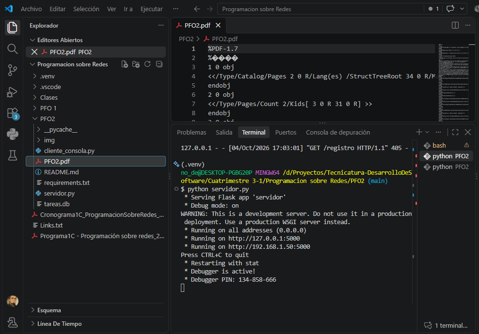
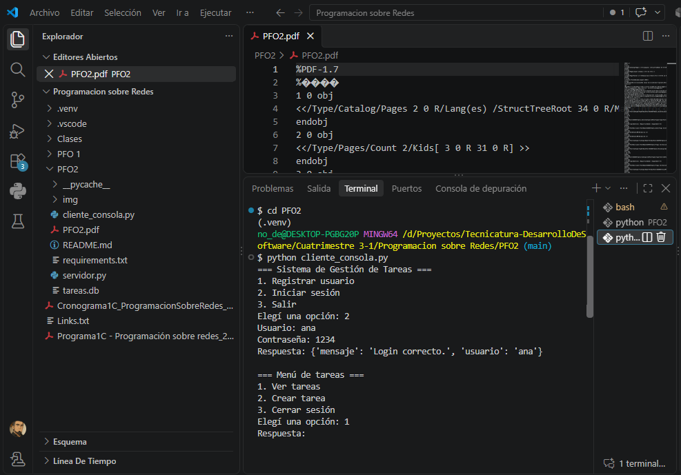

# PFO 2 - Sistema de Gestión de Tareas con API y Base de Datos

Este proyecto implementa una API REST con Flask y SQLite para gestionar usuarios y tareas, además de un cliente de consola que interactúa con la API.

## Requisitos

- Python 3.10 o superior
- Entorno virtual local (`.venv`) dentro del proyecto
- Flask (se instala en el entorno virtual del proyecto)

## Estructura del proyecto

- `servidor.py`: API Flask con SQLite
- `cliente_consola.py`: cliente interactivo para probar la API
- `tareas.db`: base de datos SQLite creada automáticamente
- `requirements.txt`: dependencias del proyecto

## Instalación

1. Abrir la terminal en la carpeta del proyecto.
2. Activar el entorno virtual local si ya existe:

   ```powershell
   .\.venv\Scripts\Activate.ps1
   ```

3. Si Flask no está instalado en ese entorno, ejecutar:

   ```powershell
   python -m pip install -r requirements.txt
   ```

## Ejecutar el servidor

Desde la carpeta `PFO 2`, correr:

```powershell
python servidor.py
```

La API quedará disponible en:

```text
http://localhost:5000
```

## Probar la API

### Registro de usuario

```powershell
curl -X POST http://localhost:5000/registro -H "Content-Type: application/json" -d "{\"usuario\":\"ana\",\"contraseña\":\"1234\"}"
```

### Login

```powershell
curl -X POST http://localhost:5000/login -H "Content-Type: application/json" -d "{\"usuario\":\"ana\",\"contraseña\":\"1234\"}"
```

### Ver tareas (autenticación básica)

```powershell
curl -u ana:1234 http://localhost:5000/tareas
```

### Crear tarea

```powershell
curl -X POST http://localhost:5000/tareas -u ana:1234 -H "Content-Type: application/json" -d "{\"titulo\":\"Estudiar Flask\",\"descripcion\":\"Repasar endpoints y SQLite\"}"
```

## Cliente de consola

En otra terminal, ejecutar:

```powershell
python cliente_consola.py
```

El menú permite:

- Registrar usuario
- Iniciar sesión
- Ver tareas
- Crear tareas
- Cerrar sesión

## Respuestas conceptuales

### ¿Por qué hashear contraseñas?

Porque al guardar una contraseña sin hash, si la base de datos es comprometida, los usuarios quedan expuestos inmediatamente. El hash convierte la contraseña en un valor irreversible, de modo que incluso si alguien accede a la base de datos no puede recuperar las claves originales. Además, se usa una función segura como `generate_password_hash`, que incluye sal para proteger contra ataques de diccionario y rainbow tables.

### Ventajas de usar SQLite en este proyecto

- Es ligero y no requiere un servidor separado.
- Guarda la información en un archivo local (`tareas.db`).
- Es ideal para proyectos pequeños o educativos.
- Es fácil de configurar y mantener.
- Permite persistencia de usuarios y tareas sin depender de servicios externos.

## Capturas de pantalla

Se entrega capturas del resultado exitoso de:

1. Servidor

2. Login


## Notas

- La base de datos se crea automáticamente al iniciar el servidor.
- Las contraseñas no se almacenan en texto plano.
- La autenticación de tareas usa HTTP Basic Auth con las credenciales del usuario.
